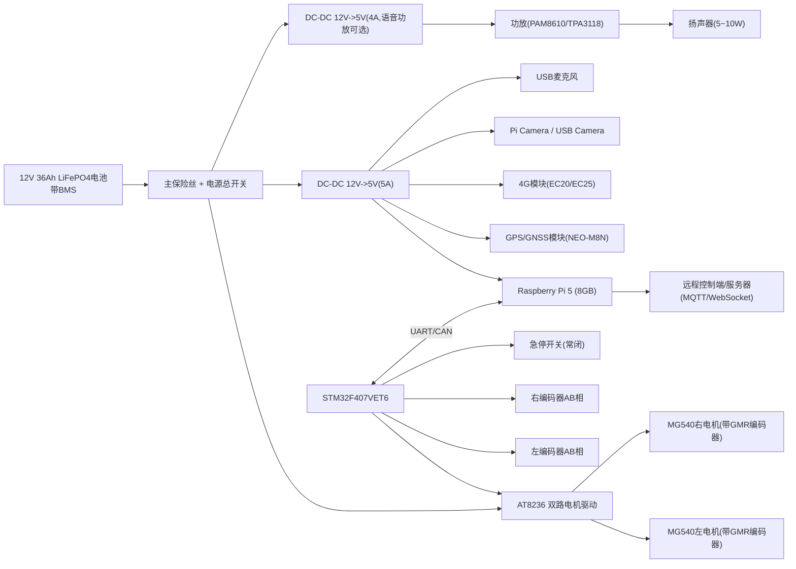
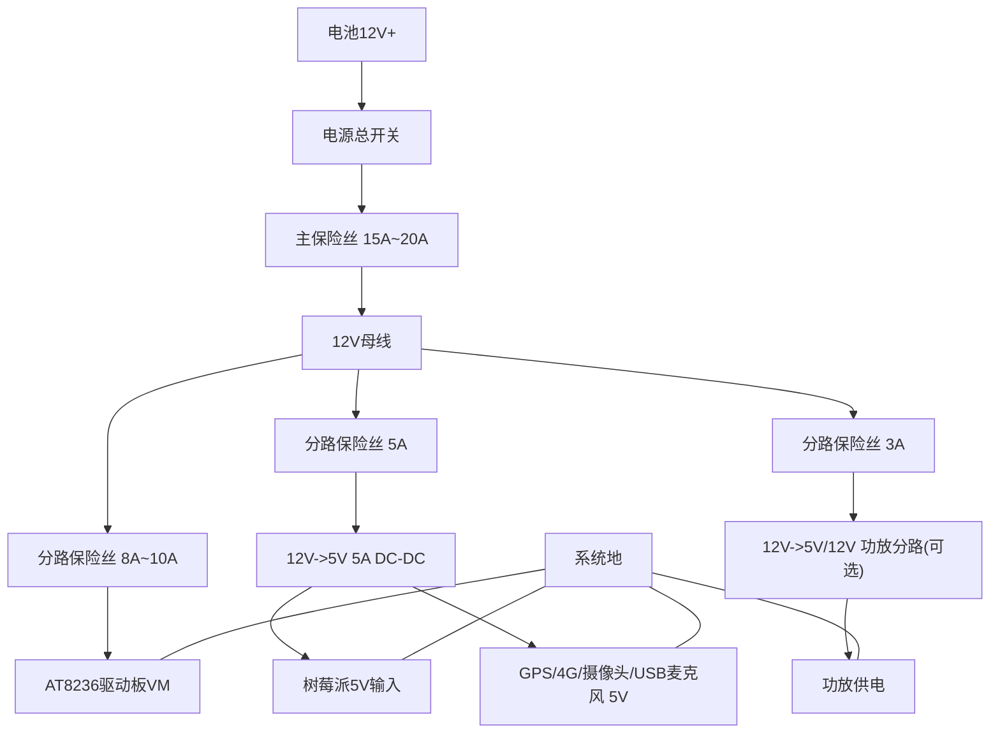

# 电动示警桩采购型号版原理图

> 适用已定型号：`STM32F407VET6`、`AT8236 双路驱动`、`MG540 12V GMR 编码电机×2`、`Raspberry Pi 5（8GB 基础套餐）`、`12V 36Ah 磷酸铁锂电池`。

## 1. 系统总原理图（框图）

## 2. 电源原理图（建议）

## 3. 控制与驱动接线（STM32F407VET6 <-> AT8236）

> 以下为推荐引脚，可按你的 PCB 布局调整；原则是：PWM 用高级定时器，编码器用定时器编码器接口，急停用外部中断。

| 功能 | STM32F407VET6 推荐引脚 | 连接对象 | 说明 |
|---|---|---|---|
| 左电机 PWM | `PA8 (TIM1_CH1)` | AT8236 `PWM_L` | 左轮速度控制 |
| 左电机方向 | `PB12` | AT8236 `DIR_L` | 左轮方向控制 |
| 右电机 PWM | `PA9 (TIM1_CH2)` | AT8236 `PWM_R` | 右轮速度控制 |
| 右电机方向 | `PB13` | AT8236 `DIR_R` | 右轮方向控制 |
| 驱动使能 | `PB14` | AT8236 `EN` | 总使能/故障后拉低 |
| 驱动故障输入 | `PB15` | AT8236 `FAULT` | 过流/故障检测 |
| 急停输入 | `PC13` | 急停常闭开关 | 外部中断，高优先级 |
| 左编码器A/B | `PA0/PA1 (TIM2)` | 左电机编码器AB | 里程计+速度闭环 |
| 右编码器A/B | `PA6/PA7 (TIM3)` | 右电机编码器AB | 里程计+速度闭环 |

## 4. 上位机通信接线（STM32 <-> 树莓派5）

### 4.1 串口方案（先跑通推荐）
| 功能 | STM32F407VET6 | 树莓派5 | 说明 |
|---|---|---|---|
| UART_TX | `PA2 (USART2_TX)` | `GPIO15 RXD` | STM32发状态 |
| UART_RX | `PA3 (USART2_RX)` | `GPIO14 TXD` | 树莓派发控制 |
| GND | `GND` | `GND` | 必须共地 |

### 4.2 CAN 方案（二期升级）
| 功能 | STM32F407VET6 | 外设 | 说明 |
|---|---|---|---|
| CAN_TX | `PB9 (CAN1_TX)` | CAN收发器 `TXD` | 后接 CANH/CANL |
| CAN_RX | `PB8 (CAN1_RX)` | CAN收发器 `RXD` | 推荐隔离电源版本 |

## 5. 树莓派5外设原理连接

| 模块 | 接口方式 | 建议连接 |
|---|---|---|
| 摄像头 | CSI 或 USB | 优先 CSI（Camera Module 3） |
| GPS NEO-M8N | UART/USB | 先 USB，后续可改 UART |
| 4G EC20/EC25 | USB | 直接接树莓派 USB3.0 |
| USB麦克风 | USB | 即插即用语音识别 |
| 功放 | 3.5mm/USB声卡/I2S | 样机建议 USB 声卡或 3.5mm |
| 扬声器 | 功放输出 | 4Ω/8Ω 5~10W |

## 6. 关键保护电路（必须加）

1. 电池总正极串联总保险丝（15A~20A）与总开关。  
2. AT8236 电源分路独立保险丝，防止电机堵转烧线。  
3. 树莓派 5V 支路单独保险（建议 5A）。  
4. 急停开关硬件优先：触发后直接拉低驱动使能 `EN`。  
5. 编码器与控制信号线远离电机电源线，必要时加磁环/TVS。  
6. 所有模块必须共地，但电机大电流回路与信号地采用星形汇聚。

## 7. 到货验收清单（按你已选套餐）

### 7.1 树莓派5基础套餐验收
- 核对主板版本：`Raspberry Pi 5 8GB`。
- 核对电源：官方或等效 `5V 5A` 电源。
- 核对散热：风扇可正常转动，散热片/导热贴齐全。
- 核对存储：TF 卡可正常读写并启动系统。
- 核对线材：`Micro HDMI`、读卡器等配件齐全。

### 7.2 电控验收
- `STM32F407VET6` 上电下载正常，串口打印正常。
- `AT8236` 空载驱动双电机可控，方向/PWM响应正确。
- `MG540` 编码器 AB 相计数方向与转向一致。
- 急停按下后，驱动使能立即断开。

## 8. 备注

- 本文是“采购型号版接线原理图”，可直接作为你后续在 Altium/立创EDA 绘制正式原理图和PCB的依据。
- 如果你需要，我下一步可以继续给你出 `立创EDA 网表级引脚表`（每个器件的具体管脚号 + 网络名），你可以直接照着画。

